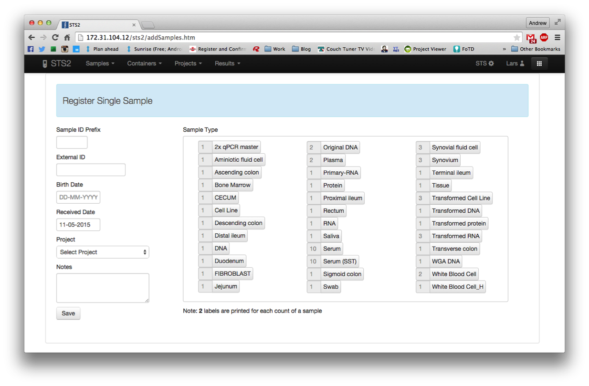
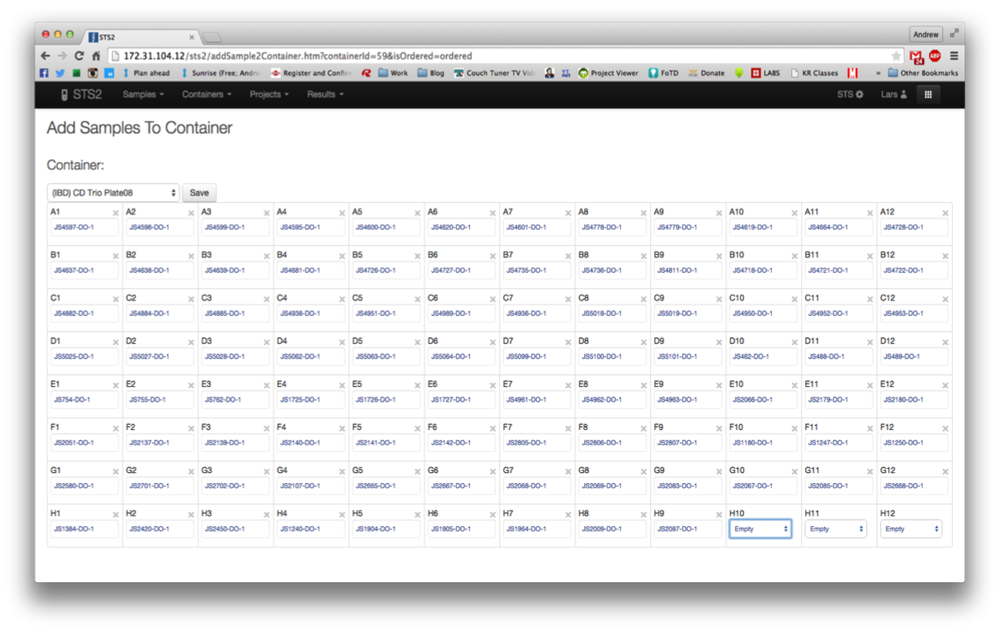
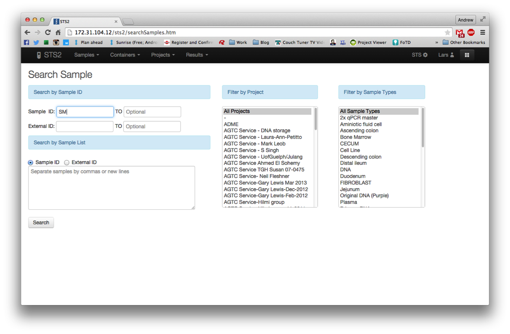
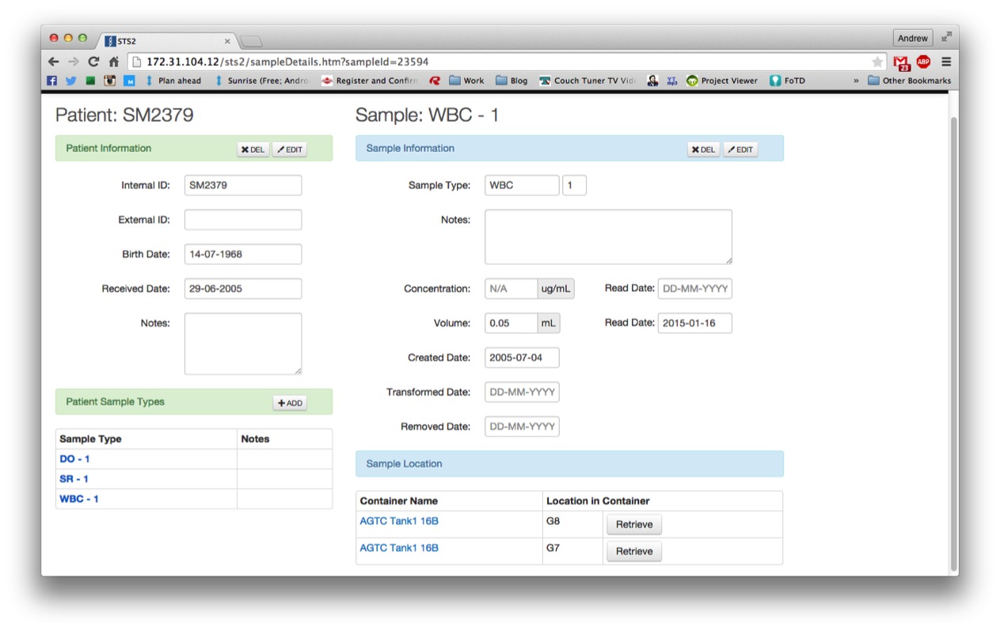
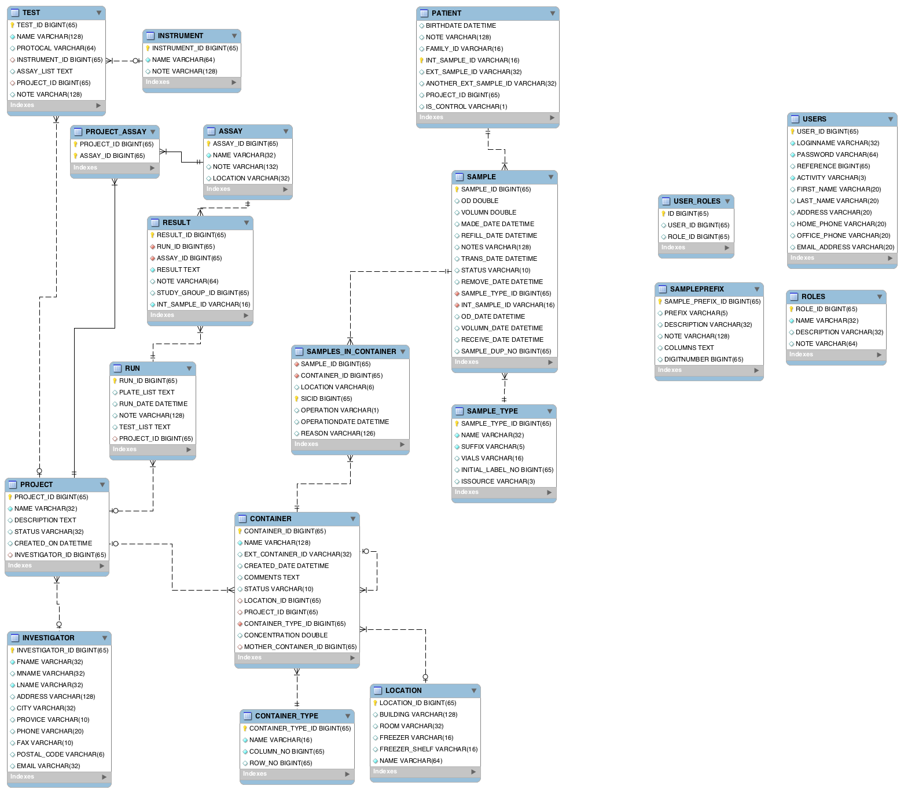

# STS2

The STS2 is the sample tracking system developed by the Office of Personalized Genomics and Innovative Medicine.

It is a mySQL database backend with a web-application interface which allows laboratory technicians to:

- Register Samples
- Assign Samples
- Search Samples
- Edit Samples

The **maven-app** folder contains the source code for the web-application.  
The **mysql** folder contains the schema for the database.

### Register Samples

Register allows technicians to register different type of samples simultaneously. 
A unique sample ID is automatically assigned upon registration. 
Also, A textfile is automatically generated that barcode label softwares can use to parse and print labels.

### Assign Samples

Assign feature allows technicians to specify which container each sample is stored in using a table as a virtual representation of the sample boxes.

### Search Samples

Search feature allows technicians to search using a specific ID, a range of ID, or a list of ID.
The search can also be further refined by filtering for sample types or projects.

### Edit Samples

Edit feature allows technicians to enter meta information such as *Volume*, *Concentration*, *External ID*, etc.

### DB Schema

